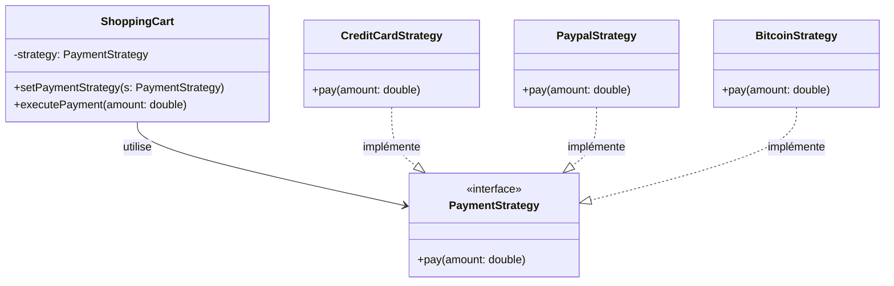

En programmation, nous sommes souvent confrontés à un dilemme : comment gérer un code qui doit effectuer une même tâche de plusieurs manières différentes, sans finir avec des structures conditionnelles interminables ?

Pour répondre à cette problématique, il existe une solution élégante issue des principes **SOLID** : le **Patron Stratégie (Strategy Pattern)**.

Dans cet article, nous allons comprendre ce concept à travers un cas concret : la gestion des paiements sur un site e-commerce.

## 1. Le Problème : Le piège des `if / else` (code spaghetti)

Imaginez que vous développez le tunnel d'achat d'une boutique en ligne. Au début, vous n'acceptez que la *Carte Bancaire*. Simple. Puis, le marketing demande d'ajouter *PayPal*, et enfin le *Bitcoin*.

L'approche naïve consiste à tout gérer dans une classe *Checkout* avec des conditions :

```java
// Ce qu'il faut éviter
public class OrderProcessor {
    public void processPayment(String method, double amount) {
        if (method.equals("CB")) {
            // ... Validation 16 chiffres, date d'expiration, appel API Stripe
        } else if (method.equals("PAYPAL")) {
            // ... Connexion OAuth, vérification du solde PayPal
        } else if (method.equals("BITCOIN")) {
            // ... Envoi vers une adresse wallet, validation blockchain
        }
    }
}

```

### Pourquoi est-ce dangereux ?

Ce code viole le **Principe Ouvert/Fermé (Open/Closed Principle)**.
Si demain vous voulez ajouter une option "Apple Pay" :

1. *Risque de régression* : En modifiant le code pour ajouter Apple Pay, vous risquez de casser le paiement par carte qui fonctionnait très bien.
2. *Lourdeur* : La classe devient un "Dieu Objet" qui connaît tous les détails techniques de chaque prestataire.
3. *Tests impossibles* : Difficile de tester unitairement le Bitcoin sans déclencher toute la logique de la classe.

## 2. La solution : Le Patron Stratégie

Le pattern Strategy suggère une approche différente : **"Défini une famille d'algorithmes, encapsule chacun d'eux, et rend-les interchangeables."**

Au lieu que le OrderProcessor sache *comment* gérer les différents paiements, il va déléguer cette tâche à des spécialistes (les stratégies).

### L'architecture en 3 parties :

1. **L'Interface (le contrat) :** Elle définit ce que toutes les stratégies doivent savoir faire (ici : `pay()`).
2. **Les stratégies concrètes :** Chaque mode de paiement (CP, Bitcoin, etc) a sa propre classe.
3. **Le contexte (le panier) :** Il possède une référence vers une stratégie et l'utilise sans connaître les détails techniques.



## 3. Implémentation en Java

Voyons comment transformer notre code "spaghetti" en une architecture propre.

### Étape A : L'interface commune

Tout d'abord, nous créons un contrat que tous nos modes de paiement devront respecter.

```java
public interface PaymentStrategy {
    void pay(double amount);
}
```

### Étape B : Les stratégies concrètes

Nous isolons chaque algorithme dans sa propre classe.

```java
// Stratégie pour les cartes bancaires
public class CreditCardStrategy implements PaymentStrategy {
    public void pay(double amount) {
        System.out.println("Paiement de " + amount + "€ via Carte Bancaire.");
    }
}

// Stratégie pour Paypal
public class PaypalStrategy implements PaymentStrategy {
    public void pay(double amount) {
        System.out.println("Paiement de " + amount + "€ via redirection PayPal.");
    }
}

// Stratégie pour Bitcoin
public class BitcoinStrategy implements PaymentStrategy {
    public void pay(double amount) {
        System.out.println("Paiement de " + amount + "€ sur la blockchain via Bitcoin.");
    }
}
```

### Étape C : Le Contexte (Le panier)

Voici la classe principale. Remarquez qu'elle ne contient **aucun** `if` ou `else` concernant le type de paiement. Elle est "propre".

```java
public class ShoppingCart {
    private PaymentStrategy paymentMethod;

    // On peut changer de stratégie dynamiquement (le fameux "Runtime")
    public void setPaymentStrategy(PaymentStrategy method) {
        this.paymentMethod = method;
    }

    public void checkout(double total) {
        if (paymentMethod == null) throw new IllegalStateException("Sélectionnez un mode de paiement !");
        // Le panier délègue le travail à la stratégie actuelle
        paymentMethod.pay(total);
    }
}
```

## 4. Utilisation finale

C'est ici que la magie opère. L'utilisateur peut changer de mode de paiement à la volée, sans qu'on ait besoin de redémarrer l'application ou de recompiler la classe ShoppingCart.

```java
public class App {
    public static void main(String[] args) {
        ShoppingCart cart = new ShoppingCart();
        
        // L'utilisateur clique sur le bouton PayPal
        cart.setPaymentStrategy(new PaypalStrategy());
        cart.checkout(49.99);
        
        // Finalement, il change d'avis et préfère sa carte
        cart.setPaymentStrategy(new CreditCardStrategy());
        cart.checkout(49.99);
    }
}

```

## Conclusion

Le Patron Stratégie nous a permis de rendre notre gestion de paiement :

* **Extensible :** Vous voulez ajouter le paiement "Chèque" ? Créez simplement une classe `ChequeStrategy`. Vous n'avez même pas besoin d'ouvrir le fichier `ShoppingCart.java`.
* **Maintenable :** Chaque algorithme est isolé. Un bug dans le mode Paypal n'affectera jamais le mode Chèque.
* **Lisible :** Nous avons éliminé les blocs conditionnels complexes.

La prochaine fois que vous voyez un `switch` ou une série de `if/else` qui sélectionne un comportement, demandez-vous : *"Ne devrais-je pas utiliser une stratégie ici ?"*